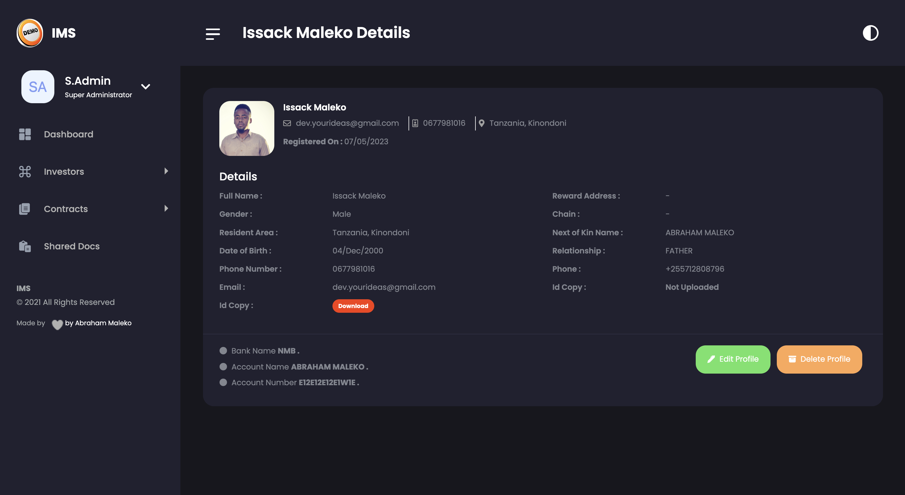

# Investors Management System (IMS)

IMS is a web based systems which aims to facilitate management of Investors which can be used by any Investors Organization you can customize per your own specifics.

## Screenshots
<div style="display:flex;">


</div>

<div style="display:flex; margin-top:1.5rem;">


  
</div>
<div style="display:flex; margin-top:1.5rem;">
 

  
</div>

## Requirements
- Composer installed
- Php 8 +

### HOW TO INSTALL THE APP
- Clone your project into you web server directory
- Composer install
- Rename .env-example to .env and configure your enviroment settings
- Run the migrations

Run the seeder below which will create a super administrator for you application you can later customize this in the user profile

```
php artisan db:seed
```
Then you can login the following credentials
- Username: admin@domain.com
- Password: Admin@2023

## HOW THE SYSTEMS WORKS

In general all users are categorized as follows
- Super Administrator
- Staff
- Investor

By default the app uses email verification for registered so you need to set your mail configurations in .env file

Users can 
- Update their user profile details (name,email,password)
- Email password resets
- Can upload profile picture also you need to create a symlink of the storage to public directory which you can do with command

```
php artisan storage:link
```
- Option to enable two factor authentication
- Access shared documents uploaded by the admin


## Super administrators
- Register investors and create their user accounts
- Create staff and assign them with permissions
- Upload investor contracts
- Can upload default shared documents which will be accessible to investors

By default staff users will have a password of 'Staff@2023' and investors a password of  'Investor@2023' and you can change this in the app file in the config directory

All created users will be prompted to change their default password on their first log in attempt

### Staff
This users have permissions to
- Add Investors Profile 
- Edit Investors Profile 

### Investors
- View their investor profile
- View their contracts
- Access the shared documents
### Have Fun Working with IMS

